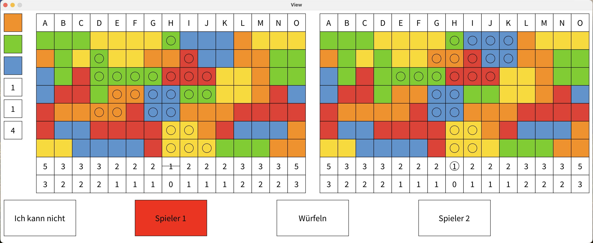
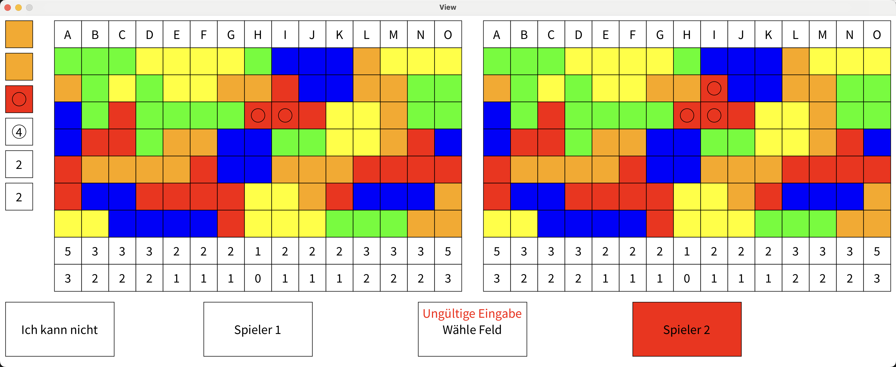
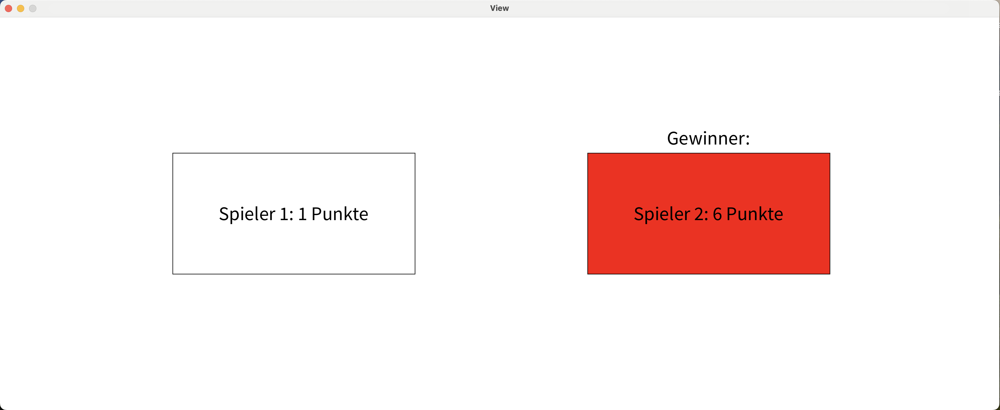

# Noch mal!

Das beliebte Würfelspiel "Noch mal!", ein fesselndes und unterhaltsames Spiel für zwei Personen, das Freunde und Familien gleichermaßen begeistert. In "Noch mal!" geht es darum, durch geschicktes Würfeln und strategische Auswahl von Farben und Zahlen die meisten Punkte zu sammeln und zum Sieger der Runde zu werden.

# Spielübersicht

"Noch mal!" ist ein schnelles und intuitives Spiel, das sowohl Glück als auch strategisches Denken erfordert. Die Spieler würfeln abwechselnd mit Farb- und Zahlenwürfeln und füllen daraufhin Felder auf ihrem Spielfeld aus. Durch das Ausfüllen kompletter Spalten und Reihen können Punkte gesammelt werden, aber Vorsicht: Jede Entscheidung kann auch dem Mitspieler zum Vorteil gereichen!

## Verwendete Bibliotheken
Das Programm verwendet die folgenden Bibliotheken:

- [Processing](https://processing.org)
- [JUnit](https://junit.org)

## Screenshot
Ein Screenshot des laufenden Spiels:

Ein Screenshot bei fehlerhafter Eingabe:

Ein Screenshot des Endbildschirms:

## Startanleitung
Zum *Starten* müssen folgende Schritte berücksichtigt werden:

1. Öffnen der Datei `Main.java`
2. Starten der der Funktion `main()`

## JShell Anleitung

Zum Starten in der JShell muss ein Terminal gestartet werden und die Befehle aus der Datei `JShell.txt` in das Terminal kopiert werden. Anschließend kann mittels Eingaben im Terminal gespielt werden.