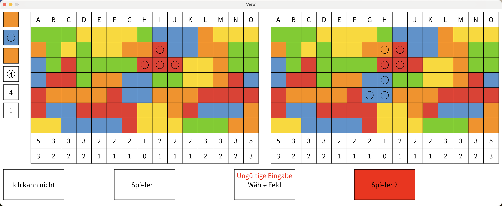

# Noch mal!

Das beliebte Würfelspiel "Noch mal!" ist ein fesselndes und unterhaltsames Spiel für zwei Personen, das Freunde und Familien gleichermaßen begeistert. In "Noch mal!" geht es darum, durch geschickte Auswahl von Farben und Zahlen sowie strategische Auswahl von Feldern die meisten Punkte zu sammeln und zum Sieger der Runde zu werden.

# Spielübersicht

Nach dem Würfeln der Farb- und Zahlenwürfel wählt der Spieler die beiden günstigsten Würfel durch Anklicken aus. Anschließend markiert er die gewünschten Felder auf seinem Spielfeld. Das erste ausgewählte Feld eines Zuges muss entweder in Spalte H, am Rand des Spielfeldes oder neben einem bereits markierten Feld liegen. Alle darauffolgenden Felder müssen neben einem in diesem Zug markierten Feld liegen. Sobald ein Spieler sieben Spalten voll hat, ist das Spiel zu Ende und der Spieler hat gewonnen.

## Verwendete Bibliotheken
Das Programm verwendet die folgenden Bibliotheken:

- [Processing](https://processing.org)
- [JUnit](https://junit.org)

## Screenshot
Ein Screenshot des laufenden Spiels:

Ein Screenshot bei fehlerhafter Eingabe:

Ein Screenshot des Endbildschirms:

## Startanleitung
Zum *Starten* müssen folgende Schritte berücksichtigt werden:

1. Öffnen der Datei `Main.java`
2. Starten der Funktion `main()`

## JShell Anleitung

Zum Starten in der JShell muss ein Terminal gestartet werden und die Befehle aus der Datei `JShell.txt` in das Terminal kopiert werden. Anschließend kann mittels Eingaben im Terminal gespielt werden.